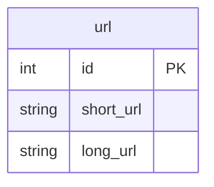
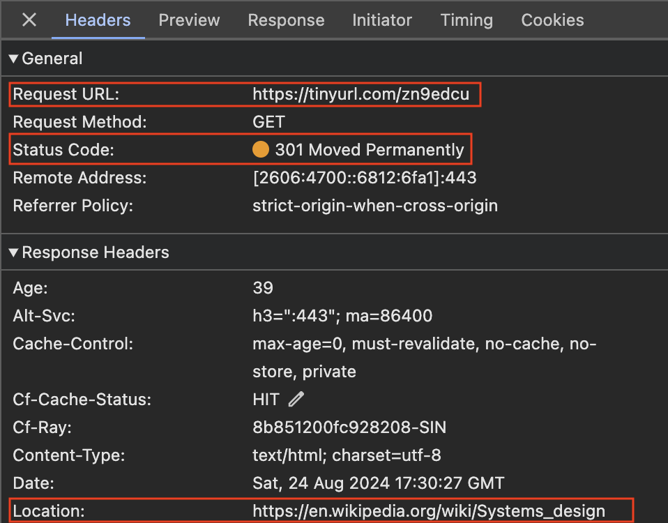
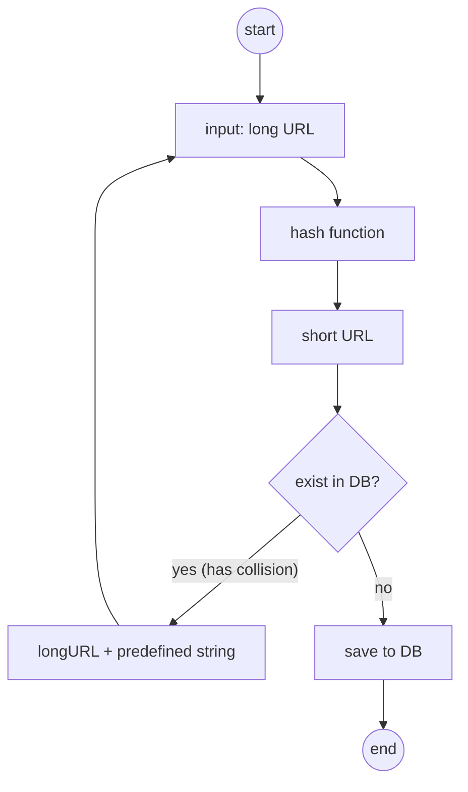
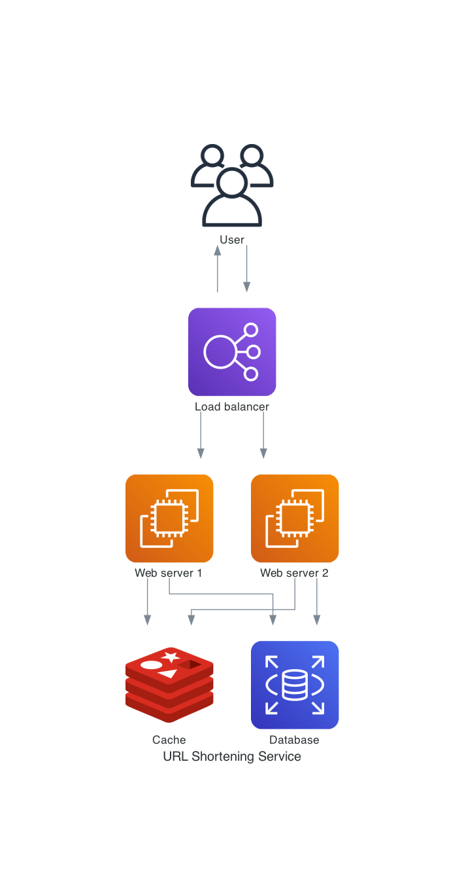

# Design URL Shortener

## Clarifications

Q: Do we need to handle delete or update?  
A: For simplicity, not required.

Q: Do we need to handle authentication and authorization?  
A: For simplicity, not required.

Q: How long will the system be running?  
A: For at least 10 years.

## High-level Estimation

### Write

- 100 million URLs generated per day
- 100 million / 24 / 3600 ~= 1160 requests/sec

### Read

- Ratio of read to write is 10:1
- 1160 \* 10 ~= 11,600 requests/sec

### Storage

- Assume average URL length is 100 characters
- 100 million \* 365 \* 100 bytes \* 10 ~= 365 TB

## API Design

  

  <code>POST</code> 
  <code><b>/api/v1/shorten</b></code>
  

### Request Parameters

> | name      | type     | data type | description             |
> | --------- | -------- | --------- | ----------------------- |
> | `longUrl` | required | string    | The long URL to shorten |

### Responses

> | http code | content-type               | response                                 |
> | --------- | -------------------------- | ---------------------------------------- |
> | `200`     | `text/plain;charset=UTF-8` | `Created successfully`                   |
> | `400`     | `application/json`         | `{"code":"400","message":"Bad Request"}` |

  

  <code>GET</code> 
  <code><b>/api/v1/{shortUrl}</b></code>
  

### Request Parameters

> | name       | type     | data type | description                       |
> | ---------- | -------- | --------- | --------------------------------- |
> | `shortUrl` | required | string    | Short URL to redirect to long URL |

### Responses

> | http code | content-type | response |
> | --------- | ------------ | -------- |
> | `301`     |              |          |

## Schema Design

## Detailed Design

### URL Redirection

The image below shows the request and response when you enter a tinyurl onto your browser. Upon receiving the request, the server changes the short URL to the long URL and respond with 301 redirect.

#### 301 Status Code

A 301 status code indicates that the requested URL has been “permanently” moved to the new long URL. The browser caches the response and subsequent requests will not be sent to the servers.

#### 302 Status Code

A 302 status code indicates that the URL has been "temporarily" moved to the long URL. Subsequent requests for the same short URL will still be sent to the servers.

#### 301 vs 302

It is important to highlight the difference between these two status codes, as it demonstrates your understanding to the interviewer. System design is all about making tradeoffs. A key benefit of using a 301 redirect is that it reduces server load because future requests are not sent after the initial redirect. However, if tracking analytics—such as click-through rates and the source of clicks—is a priority, then a 302 redirect might be the better option.

### Architecture

### URL Shortening

#### Hash Function

A hash function converts long URL to short URL.

##### Length of Hash Value

We use all numbers,lowercase and uppercase characters from [0-9, a-z, A-Z]. This gives us 62 possible characters. Based on our estimation, the system needs to support 365 million URLs.

62^7 ~= 3.5 trillion

The length of hash value is 7 characters.

##### Hashing and Collision Resolution

We used a hash function to convert a long URL to a 7 characters string. Some common functions are CRC32, MD5 and SHA-1.

We take the first 7 characters from the output of the hash function. However, this will lead to hash collisions. To resolve collisions, we append a new predefined string until there is no more collision.

Querying the database to check if a short URL exists for every request may be expensive. We can make use of Bloom Filters to improve performance.

A Bloom filter is a compact data structure that helps you determine if an item is possibly in a set, without storing the actual items. It works by using multiple hash functions to map each item to a series of bits in a fixed-size array. When an item is added, the bits at the positions determined by the hash functions are set to 1.

To check if an item is in the set, you apply the same hash functions and see if all the corresponding bits are 1. If they are, the item is likely in the set (but there’s a small chance of a false positive). If any of the bits are 0, the item is definitely not in the set. Bloom filters are particularly useful when you need fast, memory-efficient lookups and can tolerate occasional false positives, but not false negatives.

##### Base 62 ID Generator

We can convert numeric IDs to base 62. Base 62 is a numbering system that uses 62 distinct characters to represent numbers. These characters include:

- 10 digits: 0-9
- 26 lowercase letters: a-z
- 26 uppercase letters: A-Z

In Base 62, the number system works similarly to how Base 10 (our usual decimal system) works, but instead of just using digits from 0 to 9, it uses all these 62 characters.

For example:

- The number 0 in Base 10 is 0 in Base 62.
- The number 10 in Base 10 is a in Base 62.
- The number 61 in Base 10 is Z in Base 62.
- The number 62 in Base 10 would be 10 in Base 62 (similar to how 10 in Base 10 means “one 10 and zero 1s”).

##### Hashing and Collision Resolution vs Base 62 ID Generator

| Hash and Collision Resolution                                         | Base 62 ID Generator                                                                                           |
| --------------------------------------------------------------------- | -------------------------------------------------------------------------------------------------------------- |
| Fixed short URL length.                                               | The short URL length is not fixed. It increases with the ID.                                                   |
| Does not need a unique ID generator.                                  | Requires a unique ID generator.                                                                                |
| Collision is possible and must be resolved.                           | Collision is impossible because ID is unique.                                                                  |
| Impossible to predict the short URL because it does not depend on ID. | Easy to predict the next available short URL if ID increments by 1 for a new entry. May be a security concern. |

### URL Redirection

1. User clicks on a short URL link.
2. The load balancer delegate the request to web servers
3. If the short URL is in the cache, return the long URL value from the cache.
4. If the short URL is not in the cache, query from the database, return the long URL value from the database.
5. If the short URL is not found in the database, return bad request.
